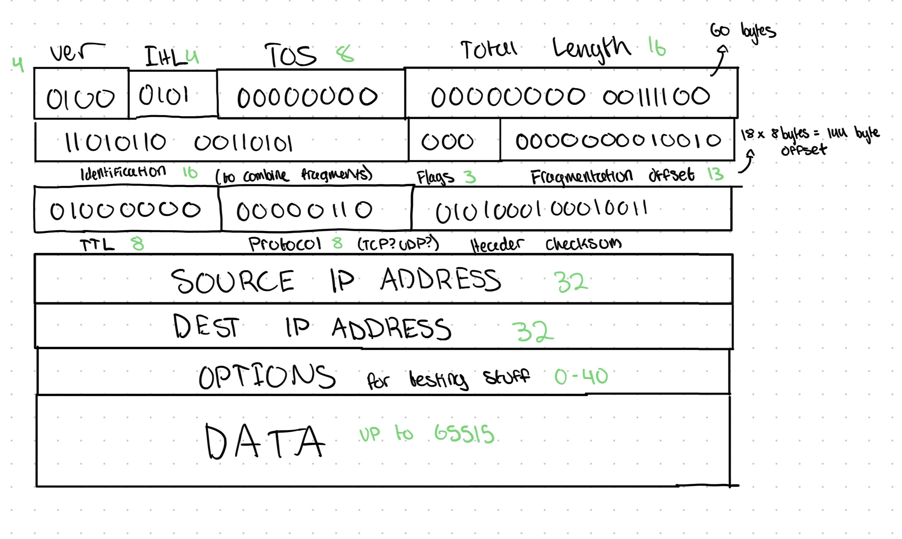

# Module 2: The Network Layer

Everything we've gone over so far is about how nodes communicate on the **same network**. The network layer was built so that devices could communicate between networks: so that **internetworks** could be built.

## How can you communicate between networks?

To send information to another device on the same network, you need the receipients MAC address. You attach their MAC address to your Ethernet frame, send it to the switch, and then the switch forwards the frame to the device.

If you wanted to send something to a friend at a different network, you would have to store a table with every one of your friend's MAC addresses, and the next hop on how to get there. Since MAC addresses have no grouping, there's no way to condense this table, and every router would end up storing an obscene number of entries to account for every device you would ever want to communicate with.

## The Internet Protocol
To solve this issue, researchers in the late 1970s came up with the **Internet Protocol**. The idea was to give every device their own **IP Address**, with a common **network id** to group devices.

In the first version, you had four octets, with the first representing a network id, and the last three serving to identify the device on the network:

> 243.104.23.1 *is the device on network 243 with host id 6,821,889.

Since there are 8 bits in an octet, there are 256(2^8) possible networks, and each network has 16,777,216(2^24) possible devices.

256 networks couldn't sustain the demand, though, and it was rare for one network to use all 16 million possiblities. So, a new standard was born:

### Classful IP Addresses

Instead of fighting for the limited number of network IDs, and then leaving 99% of the host IDs vacant, what if you could choose a **class** of IP address to claim for your need?

#### Class A
The first octet is dedicated to network ID, last three are dedicated for host IDs. This IP address is hard to get, but once you have it, you can account for 16 million unique devices. Large companies like Apple, Google, and IBM have their own Class A IP address.

#### Class B
First **two** octets dedicated to network ID, last two for host IDs.

#### Class C
First **three** octets for network ID, last one for host IDs.

#### How can you tell the difference?

The first octet looks a little different for each case:

Class A's first bit starts with a 0. This limits the number of possible network ids to 128.

Class B's first octet starts with `10`, and Class C's starts with `110`.

> Other classes D and E are used for multicast and experiments respectively.

### Subnetting

Often, large organizations with their own IP address would find they had too many host ids for their one network. Assuming you had a class A or B IP address, it was common to have tens of thousands of devices on one local network. This was clunky and slow because every time something like an ARP request is sent a broadcast would flood to every single device on the network.

To fix this, subnetting was devised. You keep your first 1-3 octets as the network ID, but then you dedicate some of the bits that used to be for identifying devices, and use them as network separators. To do this, you define a new field that every device requires to communicate: **subnet masks**.

The subnet mask tells each devices what range of IP addresses are on their local network. You compute a **bitwise AND** on your subnet mask and your IP address, do the same for the intended recepients IP address, compare the results of the bitwise AND (called the **subnet id**), and if they're the same, conclude that they're on the same local network.

This was better because you could limit the number of hosts you have to the number you need. You don't need 65,536 combinations of host IDs, you can choose to have 64.

This way, even if you only have one class B IP address, you can use subnetting to give yourself 16 logically separate networks.

For sending traffic to devices that don't share your subnet id, you simply route the IP datagram to the router, the router forwards to one of the 16 networks, does ARP to find the MAC address, and then sends it to the right device.

### CIDR

As demand increased for IP addresses, class B IP addresses became harder to get, which led to multiple class C IP addresses being stitched together for organizations. With the rapid rise of unique IP addresses though, routers' routing tables increased rapidly, increasing internet strain.

To fix this, the **Classless Inter-Domain Routing** standard was introduced. In addition to your IP address, you include a number representing the number of bits used for the network ID.

`192.168.1.0/26`: 26 bits are used to identify the network, and 6 bits are used for the host id, yielding 64 addresses on the network.

### Uh, what's the difference between Subnetting and CIDR?

Subnetting is splitting your existing ip address into multiple networks **locally**. Other devices don't see a distinction, they send all traffic to your gateway router for your IP address.

CIDR takes the idea of subnetting (defining which bits are network id and which are host id) and applies it globally. After CIDR, the distinction between classes in IP addresses was removed. Now, you include a number of bits with your IP address explaining how many bits on your IP address are dedicated for identifying the network.

## IP Datagrams

Thus far we've talked about IP addresses and how we route traffic to them. But what information is actually transferred?

The IP datagram is included in all IP traffic, and it encapsulates a payload that contains a segment of data from another protocol, typically TCP or UDP.

All IP datagrams follow the same structure, with an IP Header and a payload:

The version is to indicate whether the Internet Protocol being used is v4 or v6. The header length is necessary because of the Options section, which can range from 0-40 bytes. The Type of Service field signals priority, usually set to `00000000` for best-effort, no special handling. The Total length is used to signal the length of the header and the data. The identification, flags, and fragmentation offset are used to reassmble fragmented datagrams. The identification value will be the same across fragmented datagrams, the flags are used to tell whether the router is allowed to fragment the datagram, and the fragmentation offset is used to tell where to insert the fragments to reassmble the whole datagram.

The Time To Live is a value that's decremented on each router hop to prevent infinite loops. The protocol is to signal what type of data is in the datagram, whether that's TCP, UDP, or something else (it's usually TCP). The header checksum is a one's complement sum of the 16-bit segments of the header. In other words, it splits the header into 16 bit fragments, sums them, and stores that value.

### Why do we need to fragment?

All links between devices have a Maximum Transmission Unit (MTU). Whether you're on Ethernet or fiber or something else, the interface on that medium has a MTU. If you have a datagram that exceeds the MTU, it **needs** to be fragmented.

### How do we fragment?

The data is chopped into fragments, each with its own IP header. Once all of the fragments reach the destination, fragments with the same identification number are grouped, and then the fragmentation offset is used to combine them into one datagram.

> The receiving device knows it received the last fragment when the *More Fragments* bit in the 'flags' section is set to 0.

## Closing

We just solved the issue of getting data between *different* networks, **internetworking**, which the data link layer by itself couldn't do.

IP addresses were introduced to group devices into logical sections, reducing routing table overhead. IP datagrams were introduced to establish a standard packet format for transmitting data over internetworks.

The Internet Protocol, at its core, gets data from one host to another. It does NOT guarantee delivery, or guarantee the integrity of the data in the datagram. It only checks whether data was lost from the header. To figure out how to deal with issues like lost data or data integrity, we need to investigate the Transport layer (go to the next module!).
