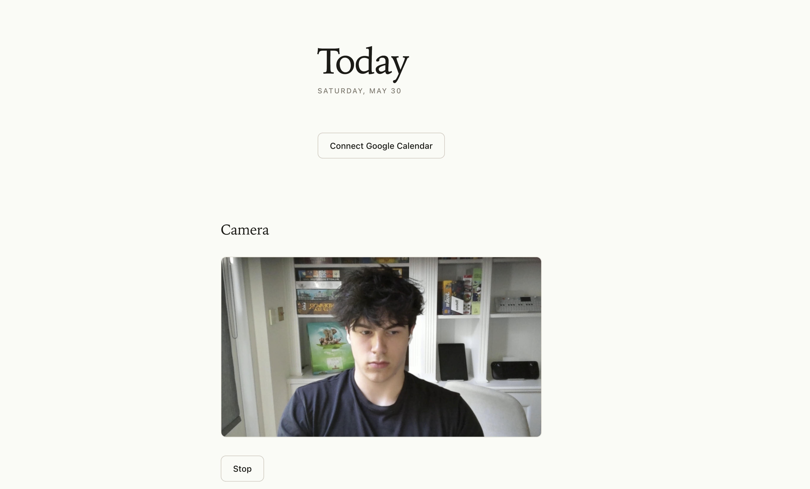
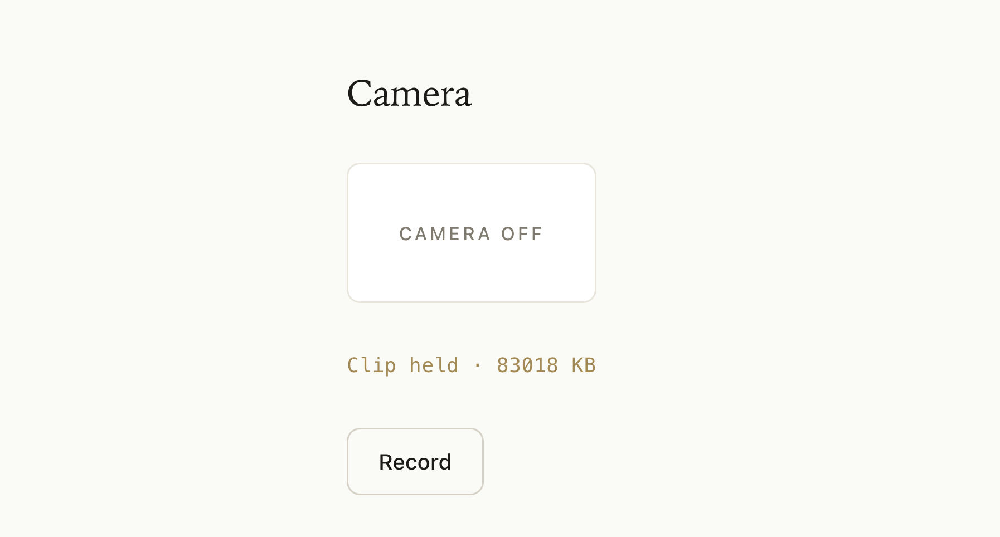

## What I worked on

Set up camera integration

Implemented timelapse capturing

## What I learned

### Camera integration

To setup the camera on our website, there are two layers:

#### capture.ts
`startCamera()` sends a request to the browser, which triggers a permission prompt, where the user gives camera access to the website. Once agreed, `getUserMedia({video: true, audio: false})` resolves to a MediaStream.

`stopStream()` loops over the stream's tracks and calls track.stop() on each, which cuts off camera access and the indicator light. (Just dropping the JS reference isn't enough because the camera stays on until the tracks are explicitly stopped.)

#### CameraRecorder.tsx
Handles the React UI on the website. Uses capture.ts when user interacts with website:

When button is clicked, `startCamera()` is called. Stores the MediaStream in a reference to stop it later.

When the session ends for some reason, this handles the UI for that, calling stopStream(), clearing the reference, and updating the UI to an idle state. 

As of now, all the camera functionality is live feed, but NOT stored anywhere. The next step is to **record** a video feed of the user studying, and store it somewhere.

I want the user to be able to click one button, start recording, forget about the website, and then end their study session, get a timelapse of the video, and share that timelapse with friends: a social incentive to study.

To make this happen, we need to make it super easy for the user to download a timelapse of their study session.

### Timelapse
First, we need to store the video after it ends:

## What's still confusing
