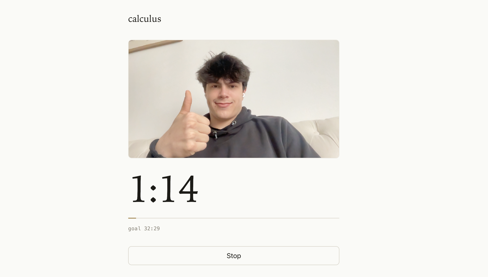

## What I worked on

Set up study session UI

## What I learned

### How should the study session UI look?

I want to visit this website routinely, associating it with my study sessions. Visiting the website should be super easy, and starting a long study session should feel buttery smooth.

There are two features I want for sure:

1. Timer/Stopwatch
    
    Use the most recent timer length as the default, make a button to start, which begins the recording and the timer.

    Should we have a stopwatch or a timer?

    I remember using pomodoro timers on my laptop, and without fail every time it cut off my focus when the timer hit the end, and I had to give myself extra time. Also, working felt less appealing when I had to hit a pre-determined goal.

    This makes me feel like a stopwatch would fit better, but there are some issues with that too. A stopwatch might give you less motivation to keep going if you don't have a goal to hit.

    The best approach I can think of is setting a stopwatch with a soft time limit. It doesn't notify you when you hit the goal, so you can stay focused, but keeps the "let's see how far I can go" mentality.

2. Calendar integration

    You should be able to start a study session from your calendar. You have a list of tasks you need to get through (math homework, essay, etc), and you select one of them and start studying for it.

    A potential issue with this is that it might feel/look a little weird if you start the task like 15 minutes into the calendar event. It might be annoying to be locked into calendar integration, where you have to change the calendar event for the website to work correctly.

    One approach is you're both able to start an empty study session or start from the calendar. This makes the website a bit more complex and less intuitive, but it might be worth it to avoid annoyances that would come from only having calendar integration.

    We can revisit this later, for now I'll force the calendar integration.

### Making the Timer UI 

I want to keep the screen empty and aesthetic. Most of the screen should be taken up by the stopwatch, with some room to see the recording and what task you're working on.

Now you can start study sessions from the calendar and download timelapses of your study sessions.

## What's still confusing

Is taking the full video required? Could I instead take images every minute or so and stitch them together? This would probably reduce battery drain.